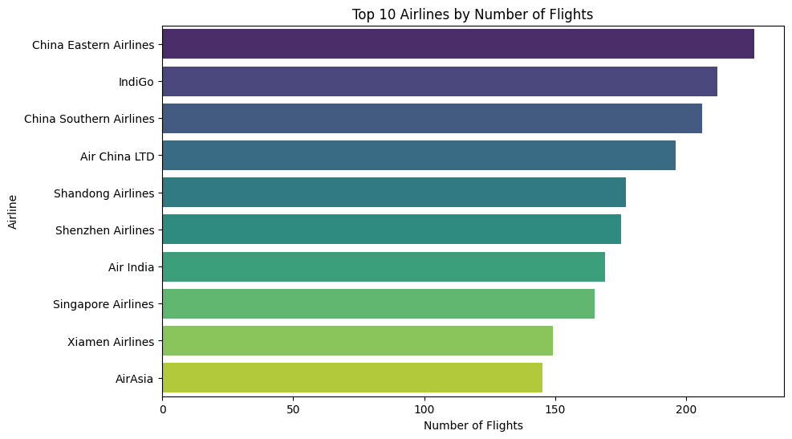
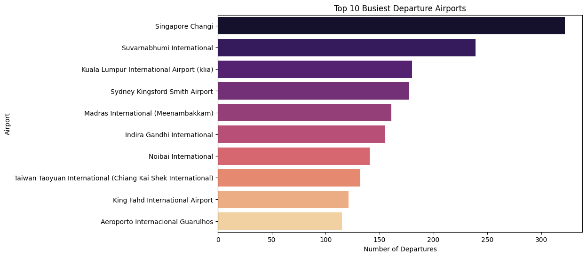
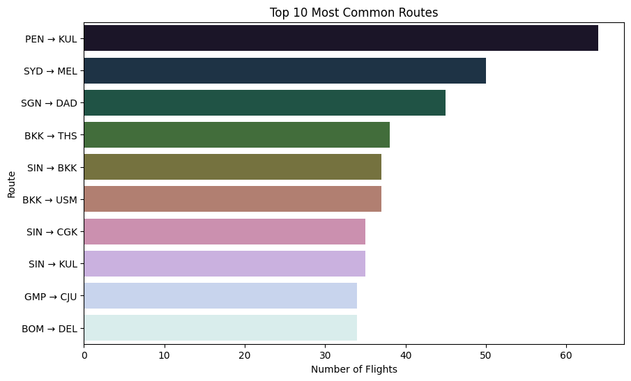
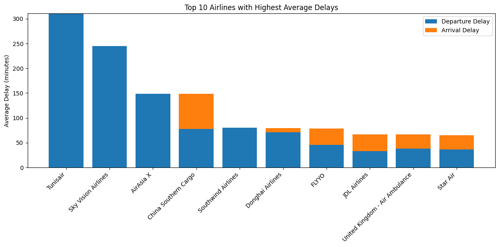
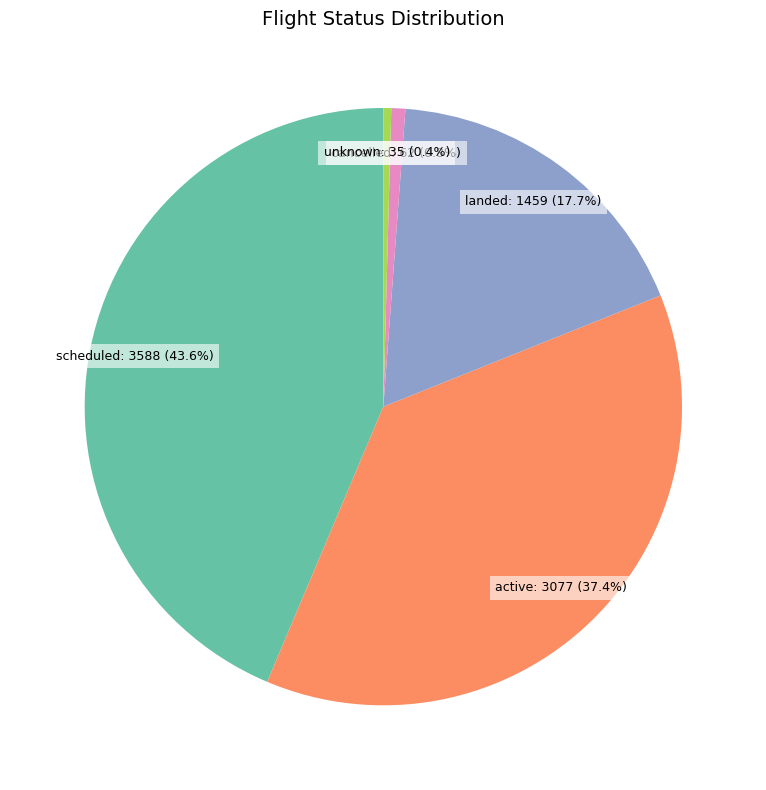
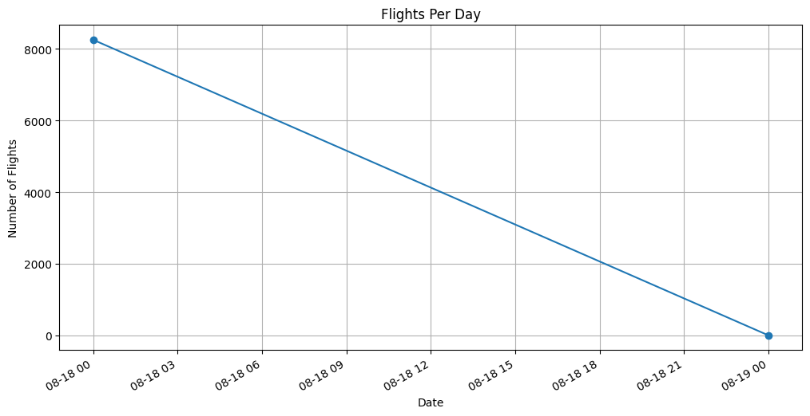
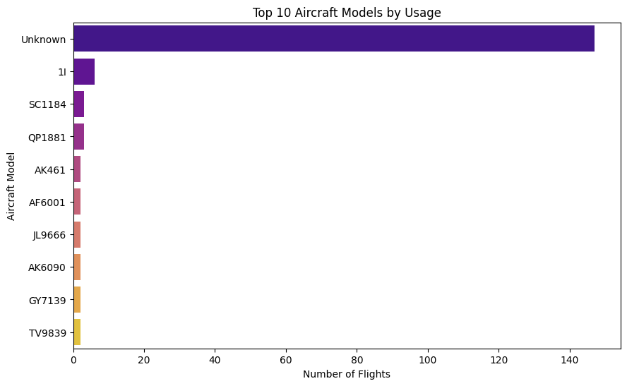

# Aviation Flights Analysis

This project analyzes flight data using the AviationStack API. It focuses on extracting insights about airlines, airports, flight routes, delays, flight statuses, and aircraft usage. The analysis was performed on a sample of 1000 flight records.

## ⚙️ Tech Stack

- Python 3.x ,(Aviation API -> requests lib)
- Pandas, NumPy – Data Cleaning & Preprocessing  
- Matplotlib, Seaborn – Data Visualization  
- Jupyter Notebook – Step-by-step Analysis  

## 📊 Exploratory Data Analysis (EDA)

The EDA provides insights into the aviation dataset through several visualizations:

### 1. Top Airlines by Number of Flights
Shows the most active airlines in terms of total flights operated.

 

### 2. Busiest Departure Airports
Identifies the airports with the highest number of departures.

  

### 3. Most Common Routes
Highlights the most frequently traveled routes between airports.

 

### 4. Average Delays per Airline
Analyzes average departure delays for the top airlines to understand punctuality.

 

### 5. Flight Status Breakdown
Shows the distribution of flight statuses (e.g., scheduled, delayed, cancelled).

  

### 6. Flights Over Time
Displays trends in daily flight counts to identify peak flight days.

 

### 7. Aircraft Models Used
Highlights the most commonly used aircraft models in the dataset.

  

---

## ✅ Key Insights

- **Most active airlines:** Airlines with the highest number of flights are easily identifiable.  
- **Busiest airports:** Some airports dominate departures, indicating hub activity.  
- **Popular routes:** Certain routes are consistently favored by passengers.  
- **Airline punctuality:** Delays vary by airline, with some consistently more punctual than others.  
- **Flight status distribution:** Majority of flights are on schedule, with delays and cancellations being minority cases.  
- **Daily flight trends:** Flight volumes fluctuate, showing peak and off-peak days.  
- **Aircraft usage:** Some aircraft models are preferred for frequent routes due to efficiency or capacity.

---

## 📝 How to Use

1. Open the provided Jupyter Notebook (`aviation_flights_analysis.ipynb`).  
2. Run the notebook step by step to reproduce the data cleaning, EDA, and visualizations.  
3. Replace placeholder images in this README with the plots you generate from the notebook.  

---

## 📂 Dataset

- **Source:** AviationStack API  
- **Local CSV:** `aviation_flights_1000.csv`  

[Download Dataset](aviation_flights.csv)
